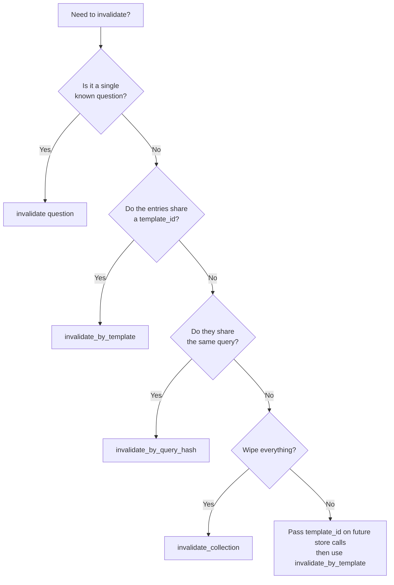

# Invalidation

Invalidation permanently removes entries from the cache. Use it when the underlying schema changes, a query is known to be incorrect, or a business rule changes that affects stored results.

!!! warning "Invalidation is permanent"

    There is no undo. Once an entry is invalidated, it is deleted from the vector backend and cannot be recovered. If you need soft-delete behaviour, use TTL instead.

---

## Invalidation Methods

| Method | Scope | Returns |
|---|---|---|
| `invalidate(question)` | One entry, matched by normalized question | `bool` — whether an entry was deleted |
| `invalidate_by_query_hash(query_hash)` | Every entry producing the same query | `int` — entries deleted |
| `invalidate_by_template(template_id)` | Every entry stored under a template | `int` — entries deleted |
| `invalidate_collection(name=None)` | The whole collection | `int` — entries dropped |

---

### 1. By Question

Remove the entry whose stored question exactly matches the provided text (after normalization):

```python
async with Medha("demo", embedder=embedder, settings=settings) as cache:
    deleted = await cache.invalidate("How many users?")
```

This performs an exact normalized-text match, not a semantic search. The question must match verbatim (modulo normalization) the question used at store time. Returns `False` if no entry matched.

The matching L1 key is removed alongside the backend entry.

---

### 2. By Query Hash

Remove every entry that generated the same query, regardless of how each question was phrased. Useful when a specific query is found to be wrong and several phrasings map to it:

```python
from medha.utils import query_hash

async with Medha("demo", embedder=embedder, settings=settings) as cache:
    deleted = await cache.invalidate_by_query_hash(
        query_hash("SELECT COUNT(*) FROM users")
    )
    print(f"Deleted {deleted} entries")
```

`query_hash()` is the same MD5 helper Medha uses at store time, so the hash always matches what is in the backend.

---

### 3. By Template

Remove every entry stored under a given `template_id`. This is the recommended approach for bulk invalidation after a schema change — pass `template_id` at store time so entries are grouped from the start:

```python
async with Medha("demo", embedder=embedder, settings=settings) as cache:
    await cache.store(
        "How many active users?",
        "SELECT COUNT(*) FROM users WHERE active = true",
        template_id="users_table",
    )
    await cache.store(
        "List all users",
        "SELECT * FROM users",
        template_id="users_table",
    )

    deleted = await cache.invalidate_by_template("users_table")
    print(f"Deleted {deleted} entries")
```

---

### 4. Whole Collection

Remove every entry in a collection. Use with caution — this wipes the entire cache namespace:

```python
async with Medha("demo", embedder=embedder, settings=settings) as cache:
    dropped = await cache.invalidate_collection()
```

The collection is dropped and re-initialized in the vector backend, so it stays usable afterwards. Pass a name to target a collection other than the main one.

!!! note "L1 cache is flushed"

    `invalidate_by_query_hash`, `invalidate_by_template`, and `invalidate_collection` clear the **entire** L1 cache, not just the affected keys — the L1 tier is keyed by question hash and cannot be filtered by backend criteria. Expect a brief drop in hit rate after a bulk invalidation.

---

## Decision Tree



!!! tip "Group your entries at store time"

    The most maintainable invalidation strategy is to pass a `template_id` on every `store()` call, grouping entries by domain (`"users"`, `"orders"`, `"inventory"`) or schema version (`"schema_v2"`). When a table changes, a single `invalidate_by_template` call removes all affected queries.
