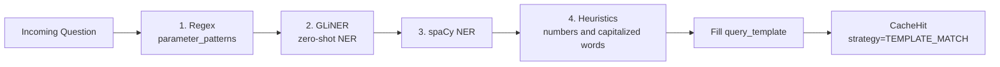

# Templates

Query templates let Medha match questions with variable slots — "Sales in {city} for {date_range}" — and fill in parameters extracted from the user's natural-language question. This is Tier 1 of the waterfall search.

---

## `QueryTemplate` Field Reference

| Field | Type | Required | Description |
|---|---|---|---|
| `intent` | `str` | Yes | Short label identifying the query intent (e.g. `"sales_by_region"`) |
| `template_text` | `str` | Yes | The question pattern with `{slot}` placeholders |
| `query_template` | `str` | Yes | The query to return, using the same `{slot}` placeholders |
| `parameters` | `list[str]` | No | Names of the slots to extract. Default `[]` — a slot not listed here is never filled |
| `parameter_patterns` | `dict[str, str]` | No | Regex per slot for precise extraction. Default `{}` |
| `priority` | `int` | No | `1` (highest) to `5`. Contributes a small scoring bonus. Default `1` |
| `aliases` | `list[str]` | No | Alternative phrasings. Default `[]` |

!!! warning "`aliases` currently has no effect on matching"

    Aliases are embedded and persisted to an internal template collection at startup, but that collection is never queried — Tier 1 scores against `template_text` only. Populating `aliases` will not broaden what a template matches today.

---

## Template Syntax

Slots are defined with curly braces: `{slot_name}`. During matching, Medha extracts named entities from the incoming question and substitutes them into the stored query.

```python
from medha.types import QueryTemplate

template = QueryTemplate(
    intent="sales_by_region",
    template_text="What were the sales in {city} during {date_range}?",
    query_template=(
        "SELECT SUM(amount) FROM sales "
        "WHERE city = '{city}' AND sale_date BETWEEN {date_range}"
    ),
    parameters=["city", "date_range"],
)
```

The query string goes in `query_template`, and every slot used in it must be listed in `parameters` — a slot that is not declared is never extracted, and the unsubstituted placeholder discards the match.

Slots can also use regular expression patterns for more precise extraction. These go in `parameter_patterns`, keyed by slot name:

```python
template = QueryTemplate(
    intent="orders_by_customer",
    template_text="Show me orders from {customer} in the last {n} days",
    query_template=(
        "SELECT * FROM orders WHERE customer_name = '{customer}' "
        "AND created_at >= NOW() - INTERVAL '{n} days'"
    ),
    parameters=["customer", "n"],
    parameter_patterns={
        "customer": r"\bfrom\s+([A-Za-z\s]+?)\s+in\s+the\s+last\b",
        "n": r"\b(\d+)\s+days?\b",
    },
)
```

Anchor the patterns to the surrounding words rather than matching the value alone: an unanchored `[A-Za-z\s]+` matches from the start of the question and swallows the whole phrase.

---

## Loading Templates from File

Templates can be pre-loaded from a JSON file with `load_templates_from_file()`, or passed directly to the `Medha` constructor.

The file must be a JSON array of objects matching the `QueryTemplate` schema:

```json
[
  {
    "intent": "sales_by_region",
    "template_text": "What were the sales in {city} during {date_range}?",
    "query_template": "SELECT SUM(amount) FROM sales WHERE city = '{city}'",
    "parameters": ["city", "date_range"]
  },
  {
    "intent": "order_count_by_status",
    "template_text": "How many {status} orders do we have?",
    "query_template": "SELECT COUNT(*) FROM orders WHERE status = '{status}'",
    "parameters": ["status"]
  }
]
```

```python
from medha import Medha, Settings
from medha.embeddings.fastembed_adapter import FastEmbedAdapter

async with Medha(
    "demo",
    embedder=FastEmbedAdapter(),
    settings=Settings(),
) as cache:
    await cache.load_templates_from_file("templates.json")
```

Alternatively, pass the templates in directly with the `templates` argument:

```python
async with Medha(
    "demo",
    embedder=FastEmbedAdapter(),
    settings=Settings(),
    templates=[sales_template],
) as cache:
    ...
```

!!! note "JSON only"

    `load_templates_from_file()` uses `json.load()`, so YAML template files are not supported. `warm_from_file()` is a different method — it warms the cache with question/query pairs, not templates.

---

## Scoring Formula

Tier 1 scoring is purely lexical — no embeddings are involved. A template is scored only after all of its parameters have been extracted; templates with incomplete extraction are discarded before scoring.

$$\text{score} = 0.5 \cdot \text{keyword\_overlap} + 0.3 \cdot \text{param\_completeness} + 0.02 \cdot (5 - \text{priority})$$

where:

- $\text{keyword\_overlap}$ is the fraction of `template_text` keywords present in the question, after removing stop words and `{slot}` placeholders — a coverage ratio, not a symmetric similarity
- $\text{param\_completeness}$ is the fraction of declared `parameters` that were extracted, so it is always `1.0` for a template that reaches scoring
- $\text{priority}$ is `1` (highest) to `5`, contributing between `0.08` and `0.00`

A template match fires when its score reaches `score_threshold_template` (default `0.7`).

!!! warning "The maximum achievable score is 0.88"

    With perfect keyword overlap, full extraction, and `priority=1`, the formula tops out at `0.5 + 0.3 + 0.08 = 0.88`. Setting `score_threshold_template` above `0.88` disables the template tier entirely — every question falls through to the vector tiers.

---

## Parameter Extraction Pipeline

Extraction is a cascade: each stage fills only the slots still missing, and the first stage that completes all of them wins.



1. **Regex** — patterns from `parameter_patterns`, keyed by slot name. Always tried first and the only fully deterministic stage.
2. **GLiNER** — zero-shot NER using the slot names directly as entity labels. Off by default; enable with `use_gliner`.
3. **spaCy** — NER for a fixed set of slot names (`count`/`number`, `user`/`person`/`name`, `company`/`org`/`organization`, `project`). Slot names outside this set are not resolved by this stage. Skipped when no spaCy model is installed.
4. **Heuristics** — bare numbers for numeric slots (`count`, `number`, `limit`, `top`), otherwise the first capitalized word. Multi-word values are truncated here, which is why `parameter_patterns` is recommended for anything richer than a single token.

If any declared parameter is still missing after stage 4, the template is skipped. Extracted values are then sanitized — everything outside letters, digits, spaces, hyphens, and underscores is stripped — before being substituted into `query_template`.

---

## Worked Example: Sales by Region

Define a template covering the common "sales by region" pattern:

```python
from medha.types import QueryTemplate

sales_template = QueryTemplate(
    intent="sales_by_region",
    template_text="What were total sales in {city}?",
    query_template=(
        "SELECT SUM(amount) AS total_sales\n"
        "FROM sales\n"
        "WHERE region_name = '{city}'\n"
        "GROUP BY region_name;"
    ),
    parameters=["city"],
    parameter_patterns={"city": r"\bin\s+([\w\s]+?)\s*\??$"},
)
```

`parameters` is required for the slot to be filled — without it, extraction returns nothing and `{city}` is left unsubstituted, which discards the match. The `parameter_patterns` regex is optional but recommended: the heuristic fallback takes only the first capitalized word, so `"New York"` would otherwise be extracted as `"New"`.

At search time:

| Question | Extracted `{city}` | Score | Result |
|---|---|---|---|
| "What were total sales in Rome?" | `Rome` | 0.88 | Template match |
| "What were total sales in New York?" | `New York` | 0.88 | Template match |
| "What were total sales in Tokyo?" | `Tokyo` | 0.88 | Template match |
| "Show total sales in New York" | `New York` | 0.63 | Falls through to the vector tiers |

!!! note "Templates match on phrasing, not just intent"

    The score is driven by keyword overlap with `template_text`, so a rephrasing that drops shared keywords can fall below `score_threshold_template` (default `0.7`) even when parameter extraction succeeds. Templates are a close-phrasing tier; more distant phrasings are handled by the semantic tier below them. To widen coverage, keep `template_text` centred on the keywords every phrasing shares, or lower `score_threshold_template`.
